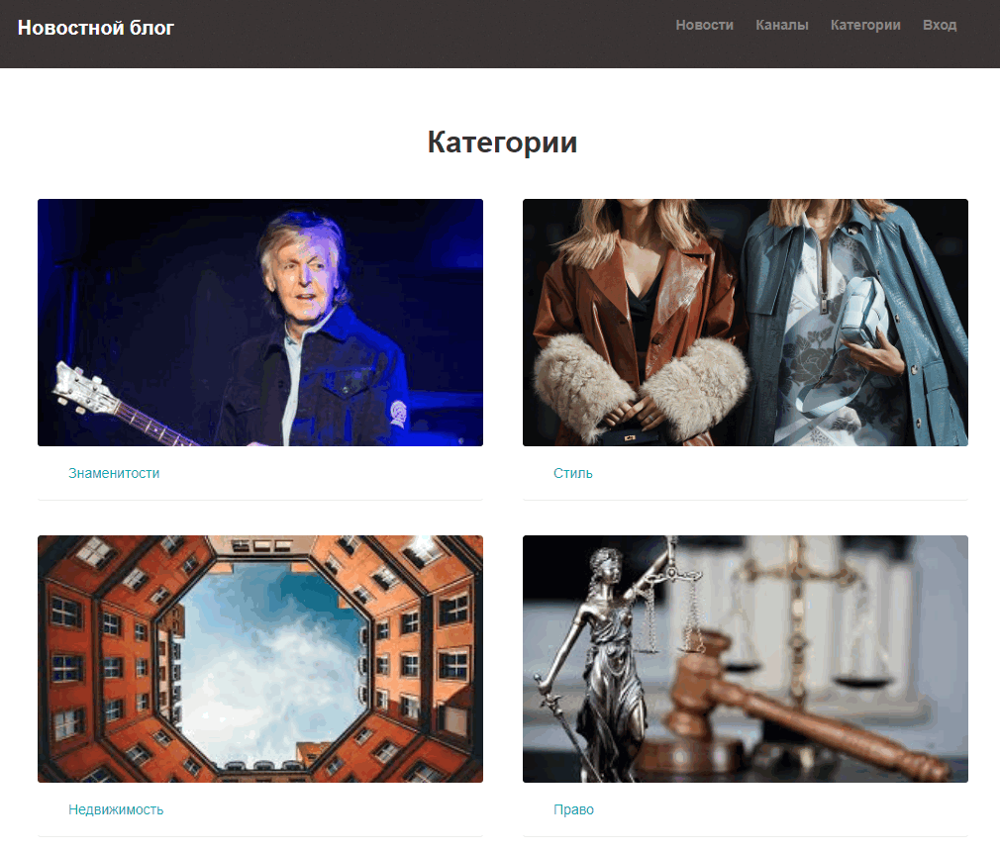
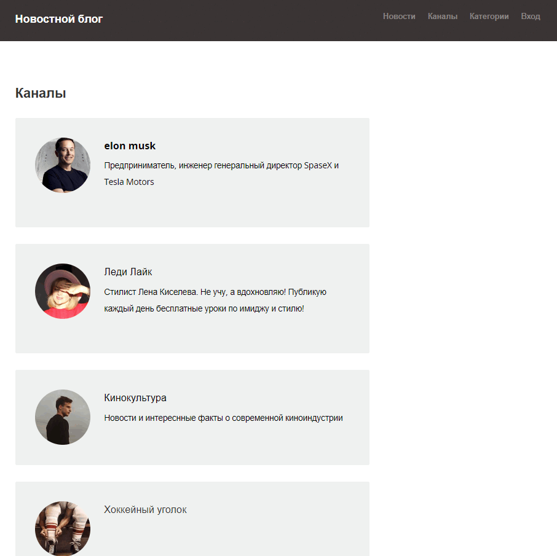
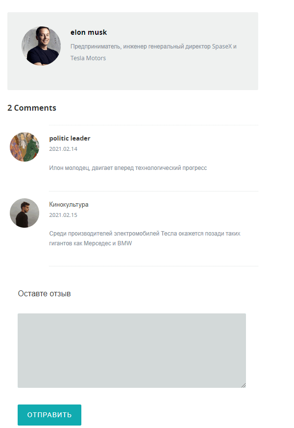
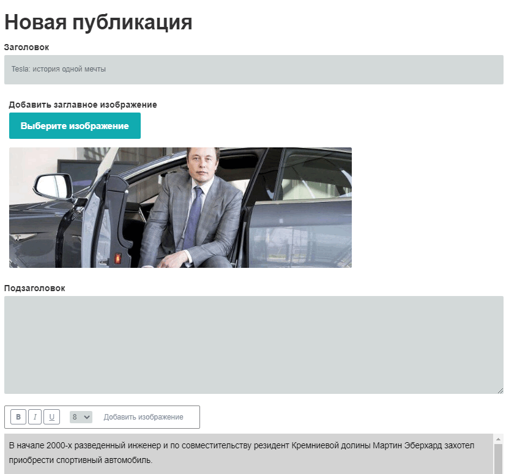
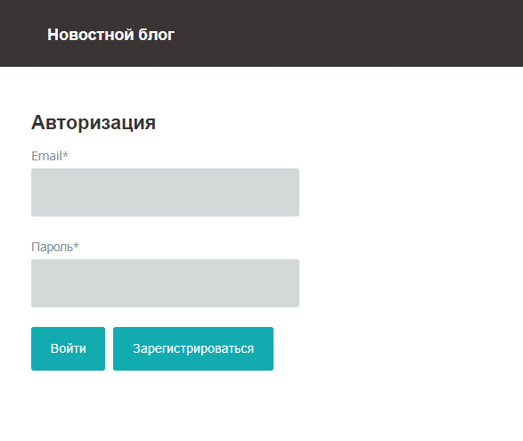
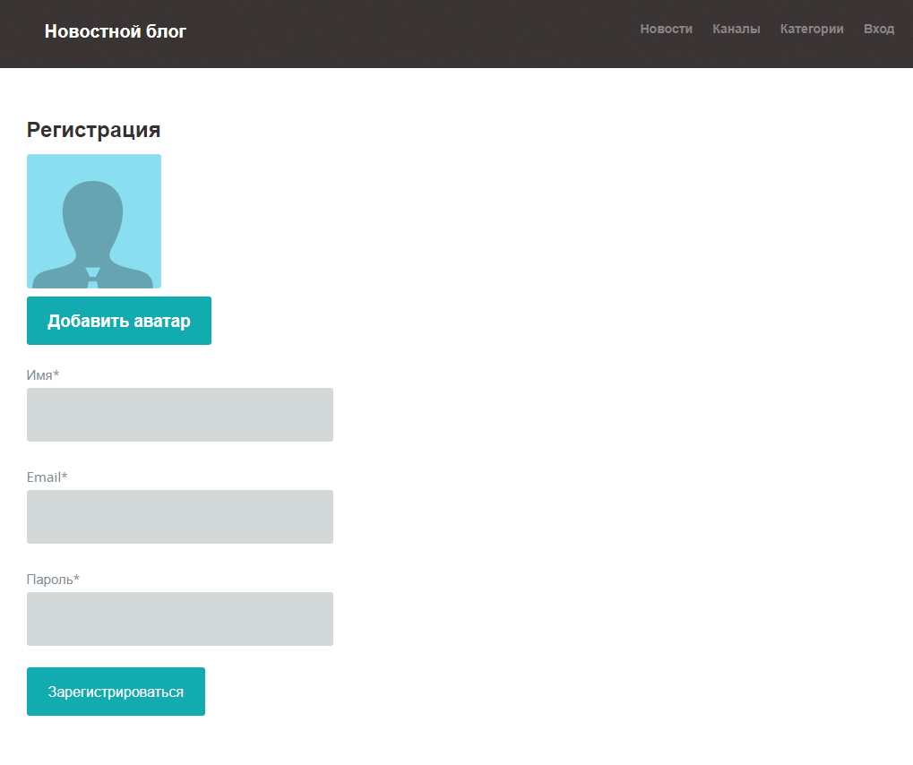

# Новостной блог
Веб-приложение для публикации статей различными пользователями. Аналог Яндекс Дзен
 
На сайте можно выкладывать запси, и оставлять комментарии - это доступно для авторизованных пользователей

Клиентская часть написана на React.js
Серверная на Node.js, Express.js, MongoDB

#### прилжение Доступно по Адресу: https://salty-oasis-86006.herokuapp.com/ - Размещено на бесплатном node.js хостинге при помощи сервиса Heroku

#### на компьютере можно запустить приложене введя команду npm run dev

## Структура Сайта

* Главная страница
* Страница со всеми записями
* Страница с выводом категорий  
* Страница категории записей 
* Страница записи
* Страница для добавления записи
* Каналы - таксономия по которой можо фильтровать записи по их автору
* Страницы Авторизации и регистрации
 
<b>Присутствует форма поиска записей</b>

## Главная страница
На главной странице выводятся Категории и Самые последние новости 

## Страница со всеми записями 
Записи выводятся списком, присутствует постраничная Пагинация - Изначально с сервера браузер получает 3 записи

## Страница с выводом категорий 
Вывод всех категорий записей

## Страница категории записей 
 Вывод записей по категории

## Каналы (Авторы записей)
 

## Страница записи

На странице записи выводится следующее:

* Содержимое записи

* Кометарии - Коментарй может оставить только авторизованный пользователь

## Страница для добавления записи

## Страницы Авторизации и регистрации

Можно создать свою учетную запись на сайте для того, чтобы оставлять записи и комментарии. Пароли храняться на сервере в захешированном виде

